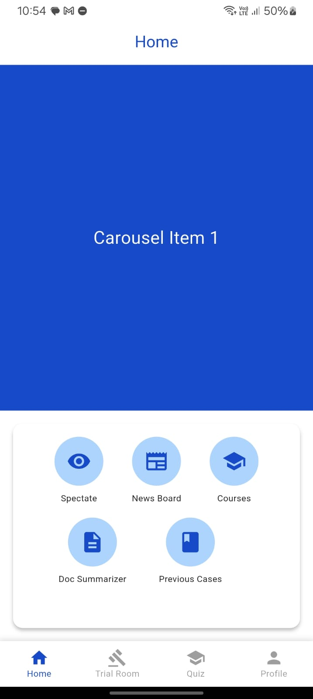
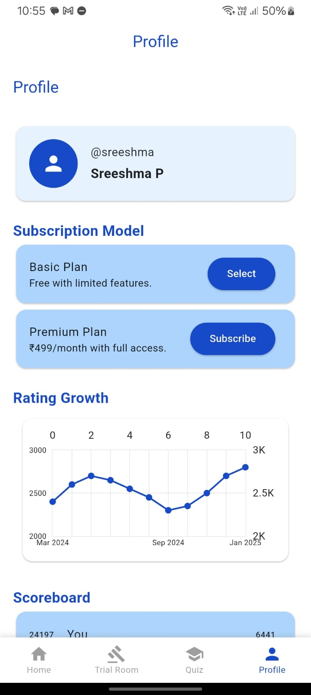

# Populex – Empowering People Through Law

> *“If law is meant to serve the people, why do both students and citizens struggle to engage with it meaningfully?”*

Populex is an innovative platform that bridges the gap between **legal education** and **public awareness**.  
It provides law students with **hands-on trial experience** while empowering the general public with **simplified legal knowledge**.

---

## Problem Statement

- **Law Students**: Lack of competitive **practical exposure** during studies.  
- **General Public**: Low **civic awareness** and difficulty in accessing legal knowledge.  

---

## About Populex
Populex solves these challenges by offering:
- **Interactive trial simulations**  
- **AI-powered tools** for summarization and evaluation  
- **Community forums** for collaboration  
- **Accessible legal resources**  

---

## Features

### Virtual Court Room
- Simulated trial room for law students and citizens.  
- Argue real or fictional cases with courtroom procedures.  
- Real-time **rating system** based on:
  - Legal terminology  
  - Procedural accuracy  
  - Persuasiveness  
- Bridges the gap between **classroom theory** and **courtroom practice**.  

### 📑 Document Summarizer
- AI-powered summarization of long legal documents.  
- Helps students and citizens quickly understand key points.  

### 📚 Educational Resources
- Courses & quizzes for **interactive legal learning**.  
- Gamified rating-based system for engagement.  

### 🌐 Community & Legal Updates
- Discussion forums to connect students, lawyers, and citizens.  
- Stay updated with **legal developments**.  

---

## Tech Stack

### 🔹 App Development
- **Frontend**: Flutter  
- **Backend**: Spring Boot, Flask  
- **Database**: PostgreSQL  

### 🔹 Virtual Trial Room
- Unity 3D  
- Blender  

### 🔹 AI & ML Integration
- **Document Summarization**: Google Gemini API  
- **Performance Feedback**:
  - Google Speech-to-Text API  
  - NLP-based legal argument evaluation  

---

## Impact

- Provides **experiential learning** for students.  
- Promotes **legal confidence** and **civic responsibility**.  
- Makes law **accessible and understandable** for everyone.  

---

## 👨‍💻 Contributors
- **N Namish Varma**  
- **P. Sreeshma**  
- **N. Praneetha Reddy**  
- **K. Tejaswini Reddy**

---

## Conclusion

Populex goes beyond traditional legal education by transforming how law is **learned, practiced, and understood**.  
It builds a foundation for:
- 🧑‍⚖️ Legal confidence  
- 🏛 Civic responsibility  
- 🌍 A more informed society

## Implementation

